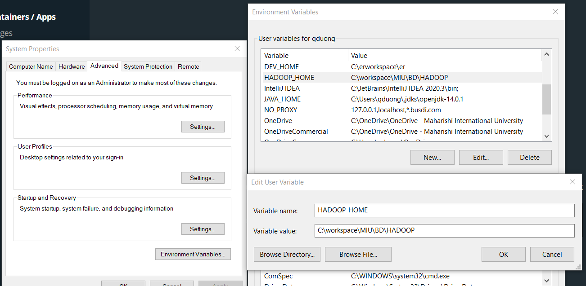
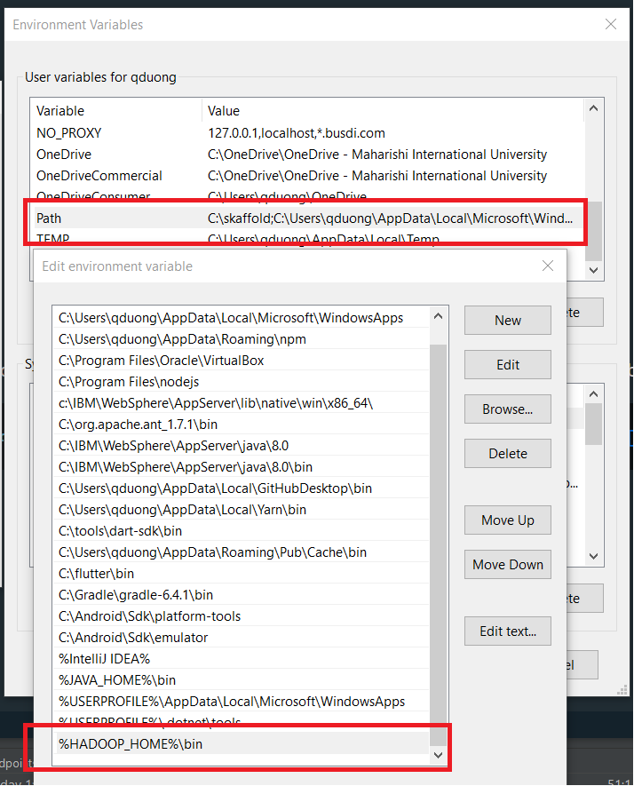
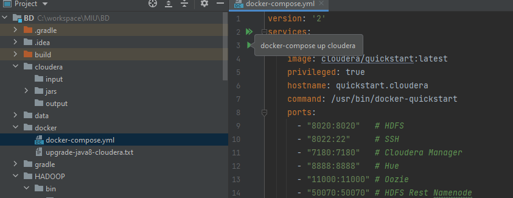

# Setup (Window)
1. add HADOOP_HOME variable to environment variables

value = C:\workspace\MIU\BD\HADOOP, HADOOP folder data from this GitHub. 

2. run Docker images :
by command 
   > docker compose -f docker\docker-compose.yml up -d

or run it from intellij IDE 

3. upgrade docker cloudera image to java 8
    - folow the guide line in this file : docker\upgrade-java8-cloudera.txt

4. submit the spark sql hive --> connect htable
> spark-submit --class "edu.miu.streaming.SparkSQLHiveJDBC" --master yarn /BDTMain/share/BDTMain.jar
> 
