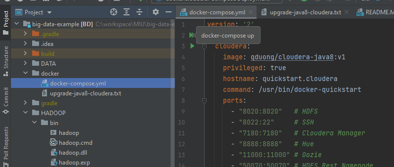

# Install Docker
First install Docker on your machine using the instructions from official website:
https://docs.docker.com/install/

After installing it, check if Docker is installed correctly opening your terminal and typing the following command:

> $ docker -v
>
>  Docker version 20.10.6, build 370c289

# Check out sample project from github

https://github.com/qduong99/big-data-example

pull github project to C:\workspace\MIU\big-data-example ( or any path you want - make sure to change below path to match with your project)

JAVA JDK 8 

# Part 1 . Setup (Window) - Run MapReduce/Spark in local mode.
1. add HADOOP_HOME variable to environment variables

value = C:\workspace\MIU\big-data-example\HADOOP, HADOOP folder data from this GitHub.

2. check Window lib ddl file
open command prompt, create folder C:/DATA
> %HADOOP_HOME%\bin\winutils.exe chmod 777 C:/DATA

if this is working then you are good to go
some machine need to install "Visual C++ Redistributable"

https://www.microsoft.com/en-us/download/details.aspx?id=26999

https://www.microsoft.com/en-us/download/details.aspx?id=48145

You may get another exception that says

`Exception in thread "main" java.lang.UnsatisfiedLinkError:
org.apache.hadoop.io.nativeio.NativeIO$Windows.access0(Ljava/lang/String;I)Z
at org.apache.hadoop.io.nativeio.NativeIO$Windows.access0(Native Method)`

to solve this : change the org.apache.hadoop.io.nativeio.NativeIO.java.bk file to
org.apache.hadoop.io.nativeio.NativeIO.java (remove ".bk")

reference : https://www.cs.helsinki.fi/u/jilu/paper/hadoop_on_win.pdf

- Restart Intellij IDE, now you can run the mapreduce / spark locally [Debuggable]

# Part 2 . Pseudo Mode - Single Cluster Hadoop Instance [Cloudera] 
1. expose daemon docker port 2375 to intellij : Open Docker For Desktop -> Setting :

Make sure Docker is using "Hyper-V backend"

https://docs.microsoft.com/en-us/virtualization/hyper-v-on-windows/quick-start/enable-hyper-v

Open PowerShell as Administrator :
`DISM /Online /Enable-Feature /All /FeatureName:Microsoft-Hyper-V`

   

open Resource Tab in Docker, add your project path to here.

[Window only] - no need expose for MAC

   

   Click to "Apply & Restart"

   - [intellij] in Services tab, click on Docker [ make sure "Docker" plugin installed in your Intellij ]
     
   

   

   FOR MAC : choose Docker for Mac

   - click on play icon on Services and Docker connected to Intellij
     
     
     
2. run Docker images :
- by command 
   > docker compose -f docker\docker-compose.yml up -d

- or run it from intellij IDE 

- popup appears on window , allow Docker to share with your local file --> press "Share It"

- Cloudera installed

- now you can submit jars file to execute on map-reduce   
3. build jars file and public to share folder, run both "jar" then "publish" tasks

  

2. submit the jars to hadoop.

- in "Services" tab in Intellij, right click on cloudera image, click on "create terminal"
  
  

- execute the hadoop command to run map-reduce :
> hadoop fs -mkdir input
>
> hadoop fs -put /DATA/input/dataFile.txt input
>
> hadoop fs -cat input/dataFile.txt

> hadoop jar /DATA/jars/BD.jar edu.miu.mapreduce.WordCount input outputHDFS
>
> hadoop fs -ls outputHDFS
>
> hadoop fs -cat outputHDFS/part-r-00000

3. Scala support 
make sure to download scala SDK 2.11.12 on your project. (by click on button "+" in global library)

